# 🔥 KevinDevSecOps | Red Team Operations & IoT Weaponization Specialist

<div align="center">
  
  
</div>

---

## 🛡️ Perfil Táctico
```yaml
# security_engineer:
- name: "Kevin"
- age: 28
- years_experience: 8
- specialization: "Red Team Operations | IoT Security"
- certifications: ["OSCP", "CEH", "EJPT"]
- toolkit: ["Kali Linux", "Flipper Zero", "HackRF", "Proxmark3"]
- philosophy: "Break -> Document -> Improve"
```

## 📌 Repositorio Actual: Leer-sobre-CK
**Common Knowledge para Operaciones Ofensivas**  
*Base de conocimiento táctico para Red Teamers profesionales*

```bash
# Stats del repositorio (actualizado al $(date +%Y-%m-%d))
- Lenguajes principales: Python (72%), PowerShell (18%), C (10%)
- Tamaño del conocimiento: 45 archivos .md | 12 categorías TTPs
- Proyectos vinculados: 3 (RedTeam-Toolkit, IoT-Pentest-Guide, Flipper-Zero-Scripts)
```

---

## 🎯 Estructura del Conocimiento

```mermaid
pie
    title Distribución de Contenido CK
    "Tácticas Red Team" : 35
    "Evasiónde EDR" : 25
    "Explotación IoT" : 20
    "Armamento C2" : 15
    "Técnicas físicas" : 5
```


---

## 🚀 Cómo Usar Este Repositorio
### Para Pentesters:
```python
# Ejemplo de carga de técnicas
from ck_tactics import lateral_movement

def execute_attack(target):
    if target.os == 'windows':
        return lateral_movement.wmi_exec(target.ip, credentials)
    elif target.is_iot():
        return lateral_movement.iot_protocol_abuse(target)
```

### Para Blue Teamers:
```sql
-- Consulta de detección
SELECT * FROM security_events 
WHERE technique_id IN (
    SELECT mitre_id FROM ck_techniques 
    WHERE risk_level > 7
)
```

---

## 🔗 Ecosistema KevinDevSecOps
| Repositorio | Descripción | Estrellas |
|-------------|------------|-----------|
| [IoT-Pentest-Guide](https://github.com/KevinDevSecOps/IoT-Pentest-Guide) | Manual avanzado de pentesting IoT |  |
| [RedTeam-Toolkit](https://github.com/KevinDevSecOps/RedTeam-Toolkit) | Mis herramientas personalizadas |  |
| [Flipper-Zero-Scripts](https://github.com/KevinDevSecOps/Flipper-Zero-Scripts) | Payloads para dispositivos IoT |  |

---

## 📊 Impacto Real
```diff
+ 2023: Auditoría de 15 dispositivos médicos IoT (CVEs descubiertos: 8)
+ 2022: Desarrollo de técnica de evasión EDR adoptada por 3 empresas de seguridad
! 2021: Charla magistral en NoConName sobre RFID hacking con Flipper Zero
```

---

## 💬 Testimonios
> "El repositorio CK de Kevin contiene técnicas que hemos implementado en nuestros ejercicios Red Team con clientes Fortune 500"  
> **— Juan Pérez, CISO @ImportantCompany**

> "Sus scripts para Flipper Zero me ayudaron a ganar el IoT CTF en DEF CON"  
> **— Ana Gómez, Pentester @HackingTeam**

---

<div align="center">
  <a href="https://github.com/KevinDevSecOps/Leer-sobre-CK/issues">
    
  </a>
  <a href="https://twitter.com/messages/compose?recipient_id=TU_ID_TWITTER">
    
  </a>
</div>


```


